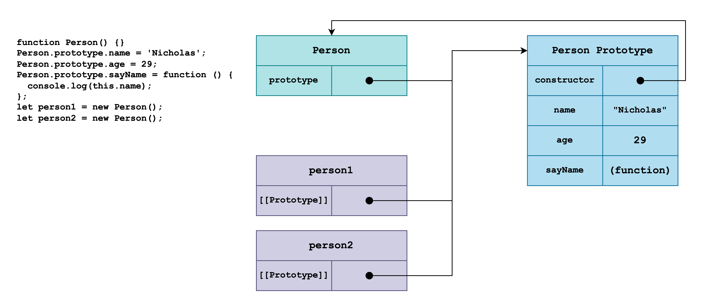

## 创建对象

通过`Object`构造函数或对象字面量可以很方便地创建对象，但是创建具有相同接口的多个对象需要编写很多重复的代码。

> 工厂模式，构造函数模式，原型模式

| 方法                      | 描述                                                         |
| ------------------------- | ------------------------------------------------------------ |
| `isPrototypeOf()`         | 判断**参数的对象原型**是否指向调用者                         |
| `hasOwnProperty()`        | 可以通过对象访问指定属性，并且该可访问的属性**在对象实例**上 |
| `Object.getPrototypeOf()` | 返回参数的**对象原型**                                       |
| `Object.setPrototypeOf()` | 为参数的对象原型设置新的值                                   |
| `Object.create()`         | 创建新的对象实例，并将实例的对象原型指定为传入的参数         |
|                           |                                                              |
|                           |                                                              |
|                           |                                                              |
|                           |                                                              |
|                           |                                                              |

### 工厂模式(Factory Pattern)

工厂模型可以解决创建多个类型对象重复代码的问题，但是没有解决对象表示问题，即新创建的对象是什么类型。

```js
// 工厂方法
function createPerson(name, age, job) {
  let person = new Object();
  person.name = name;
  person.age = age;
  person.job = job;
  person.sayName = function () {
    console.log(this.name);
  };
  return person;
}
let person1 = createPerson('Nicholas', 29, 'Software Engineer');
let person2 = createPerson('Greg', 27, 'Docker');
```

### 构造函数模式(Function Constructor Pattern)

自定义**构造函数**，通过`new`操作符创建对象实例，可以确保创建的对象实例都被标识为特定类型。

```js
// 自定义构造函数
// 构造函数也可以是函数表达式：let Person = function(name, age, job){/* do something*/}
function Person(name, age, job) {
  this.name = name;
  this.age = age;
  this.job = job;
  this.sayName = function () {
    console.log(this.name);
  };
}
// `new`操作符创建Person实例
let person = new Person('Nicholas', 29, 'Software Engineer');
```

创建的对象实例的`constructor`属性保存着对象的类型，也可以通过`instanceof`操作符确认对象类型。

```js
console.log(person.constructor); // [Function: Person]
console.log(person.constructor === Person); // true
console.log(person instanceof Object); // true
console.log(person instanceof Person); // true
```

**构造函数也是函数**

- `new`操作符创建的是一个新的对象实例，`this`指向新创建的对象。
- 直接调用构造函数，`this`会指向Global对象（浏览器环境是`window`，Nodejs环境是`global`）。
- 通过`call()`或`apply()`调用函数，`this`值会指向特定的对象。

```js
// 1.构造器创建新的实例对象，`this`指向新的实例对象。
let person = new Person('Nicholas', 29, 'Software Engineer');
person.sayName(); // Nicholas
// 2.直接调用函数，`this`指向Global对象.
Person('Greg', 27, 'Docker');
// [nodejs]运行环境
global.sayName(); // Greg
// [浏览器]运行环境
// window.sayName(); // Greg
// 3. `call()`或`apply()`，`this`指向特定的对象
let obj = new Object();
Person.call(obj, 'Kristen', 25, 'Nurse');
obj.sayName(); // Kristen
```

构造函数创建对象实例的缺点是**不同实例上的函数虽然同名，但是不相等**。

```js
// 对象中的方法是相同的，没必要创建一个实例时，都创建一个不同的`Function`实例。
let person1 = new Person('Nicholas', 29, 'Software Engineer');
let person2 = new Person('Kristen', 25, 'Nurse');
console.log(person1.sayName == person2.sayName); // false，不是同一个函数实例
```

### 原型模式(Prototype Pattern)

函数都有`prototype`属性，该属性值是一个对象，包含由特定引用类型的**实例共享**的**属性**和**方法**。`prototype`属性值对象就是通过调用构造函数创建的**对象的原型**。

```js
let Person = function () {};
// 将在构造函数中赋值给对象实例的值，赋值给原型，即Function的`prototype`属性
Person.prototype.name = 'Nicholas';
Person.prototype.age = 29;
Person.prototype.job = 'Software Engineer';
Person.prototype.sayName = function () {
  console.log(this.name);
};
let person1 = new Person();
let person2 = new Person();
console.log(person1.sayName === person2.sayName); // true
```

- 创建函数时，会按照特定的规则为函数创建一个`prototype`属性，指向**原型对象**。
- **原型对象**的`constructor`属性，指向与之关联的**构造函数**。
- 自定义构造函数时，**原型对象**默认只会获得`constructor`属性，其他的方法都继承自Object。
- 调用构造函数创建对象新实例，实例的`[[Prototype]]`指针会被赋值为**构造函数的原型对象**。
- 实例与构造函数原型之间有直接的联系，但是实例与构造函数之间没有。

```js
function Person() {}
Person.prototype.name = 'Nicholas';
Person.prototype.age = 29;
Person.prototype.job = 'Software Engineer';
Person.prototype.sayName = function () {
  console.log(this.name);
};
let person1 = new Person();
let person2 = new Person();
// 函数的`prototype`属性，指向**原型对象**
// **原型对象**的`constructor`属性，指向与之关联的**构造函数**。
console.log(Person.prototype); // {name: 'Nicholas', ..., constructor: ƒ Person(), [[Prototype]]: Object}
console.log(typeof Person.prototype); // object
console.log(Person.prototype.constructor === Person); // true
// 实例的[[Prototype]]指针会被赋值为**构造函数的原型对象**，通过实例的`__proto__`属性暴露
console.log(person1.__proto__ === Person.prototype); // true
console.log(person1.__proto__ === person2.__proto__); // true
console.log(person1.__proto__.constructor == Person); // true
```


- `isPrototypeOf()`方法会在参数的`[[Prototype]]`指向调用它的对象时返回`true`。
- `Object.getPrototypeOf()`会返回参数的对象原型。

```js
// `isPrototypeOf()`判断参数的对象原型是否指向调用者
console.log(Person.prototype.isPrototypeOf(person1)); // true
console.log(Person.prototype.isPrototypeOf(person2)); // true
// `getPrototypeOf()`获取对象实例的内部[[Prototype]]指向的对象原型
console.log(Object.getPrototypeOf(person1) === Person.prototype); // true
console.log(Object.getPrototypeOf(person1).name); // Nicholas
```

- `Object.setPrototypeOf()`可以重写实例的对象原型，可能会严重影响代码性能，谨慎使用。
- `Object.create()`可以创建一个新的对象，并为它指定对象原型。

```js
let foo = {
  x: 42,
};
let bar = {
  y: 'hello',
};
console.log(Object.getPrototypeOf(foo)); // [Object: null prototype] {}
// 将foo的对象原型设置为`bar`
Object.setPrototypeOf(foo, bar);
console.log(Object.getPrototypeOf(foo)); // { y: 'hello' }
console.log(foo.x); // 42
console.log(foo.y); // hello
// 以`bar`为原型创建对象
let barInstance = Object.create(bar);
console.log(Object.getPrototypeOf(barInstance)); // { y: 'hello' }
console.log(barInstance.y); // hello
```

通过对象访问属性时，会按照这个属性的名称先从对象实例开始搜索，如果找到则返回，如果没找到则从原型对象查找并返回。如果在对象实例上添加原型中同名属性，则会遮蔽(shadow)原型对象上的同名属性，即使将该属性设置为`null`，也会遮蔽。

```js
function Person() {}
Person.prototype.name = 'Nicholas';
let person = new Person();
// 访问对象的属性，会先在对象实例上搜索，如果没有找到则从对象原型中搜索
console.log(person.name); // Nicholas
console.log(person.anotherName); // undefined
person.name = 'Greg';
console.log(person.name); // Greg
person.name = null;
console.log(person.name); // null
delete person.name;
console.log(person.name); // Nicholas
```

`in`操作符会在可以通过对象访问指定属性时返回`true`，无论该属性是在实例上还是在原型上；`hasOwnProperty()`则只会在该可访问的属性**属于实例上**时，才会返回`true`。

```js
function Person() {}
Person.prototype.name = 'Nicholas';
let person = new Person();
// `anotherName`无法通过对象访问，`in`和`hasOwnProperty`都返回false
console.log('anotherName' in person); // false
console.log(person.hasOwnProperty('anotherName')); // false
// `name`在对象原型上，在对象实例上不存在。
console.log('name' in person); // true
console.log(person.hasOwnProperty('name')); // false
// 在实例上定义同名属性`name`
person.name = 'Greg';
console.log('name' in person); //true
console.log(person.hasOwnProperty('name')); // true
/**
 * 判断某个属性是否只在对象原型上存在
 */
function hasPrototypeProperty(obj, prop) {
  return prop in obj && !obj.hasOwnProperty(prop);
}
```

