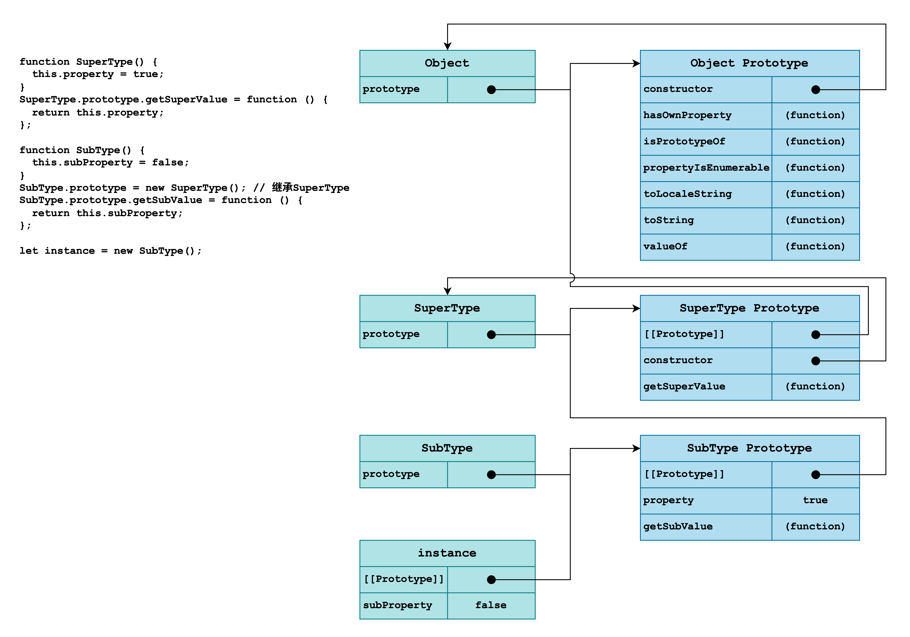

## 继承

**实现继承**是ECMAScript唯一支持的继承方式，主要是通过**原型链**实现的。

### 原型链

每个**构造函数**都有一个**原型对象**(`prototype`)，原型对象通过属性`constructor`指回构造函数，对象实例有一个内部指针(`[[Prototype]]`)指向原型对象。

将原型对象赋值为另一个类型的实例，则这个原型本身有一个内部指针指向另一个原型，相应地另一个原型也有一个指针指向另外一个构造函数。

```js
function SuperType() {
  this.property = true;
}
SuperType.prototype.getSuperValue = function () {
  return this.property;
};

function SubType() {
  this.subProperty = false;
}
SubType.prototype = new SuperType(); // 继承SuperType
SubType.prototype.getSubValue = function () {
  return this.subProperty;
};

let instance = new SubType();
console.log(instance.getSuperValue()); // true
```


- 所有引用类型都继承自`Object`，任何函数的默认原型都是一个`Object`实例，
- `SuperType.prototype = new Object()` => `SuperType.prototype`[[Prototype]] --> Object.protoType

#### 原型与继承关系
原型与实例的关系可以通过两种方式来确定。第一种方式是使用 instanceof 操作符，如果一个实 例的原型链中出现过相应的构造函数，则 instanceof 返回 true。
```
console.log(instance instanceof Object);    // true
console.log(instance instanceof SuperType); // true
console.log(instance instanceof SubType);   // true
```
确定这种关系的第二种方式是使用 isPrototypeOf()方法。原型链中的每个原型都可以调用这个 方法，如下例所示，只要原型链中包含这个原型，这个方法就返回 true:

```js
console.log(Object.prototype.isPrototypeOf(instance));    // true
console.log(SuperType.prototype.isPrototypeOf(instance)); // true
console.log(SubType.prototype.isPrototypeOf(instance));   // true
```


### 盗用构造函数/对象伪装/经典继承

使用`apply()`和`call()`方法，在子类构造函数中调用父类构造函数，解决原型包含引用值导致的继承问题。


### 原型式继承

<<JavaScript中的原型式继承>>描述了即使不自定义类型也可以通过原型实现对象之间的信息共享：

```js
// 对传入对象执行一次浅复制
function object(obj) {
  function F() {} // 临时的构造函数
  F.prototype = obj;
  return new F();
}
```

在ECMAScript5中定义的方法**`Object.create()`**将原型式继承的概念规范化了，它与`object()`方法的效果相同。

原型式继承非常适合不需要单独创建构造函数，但仍然需要在对象间共享信息的场合。


